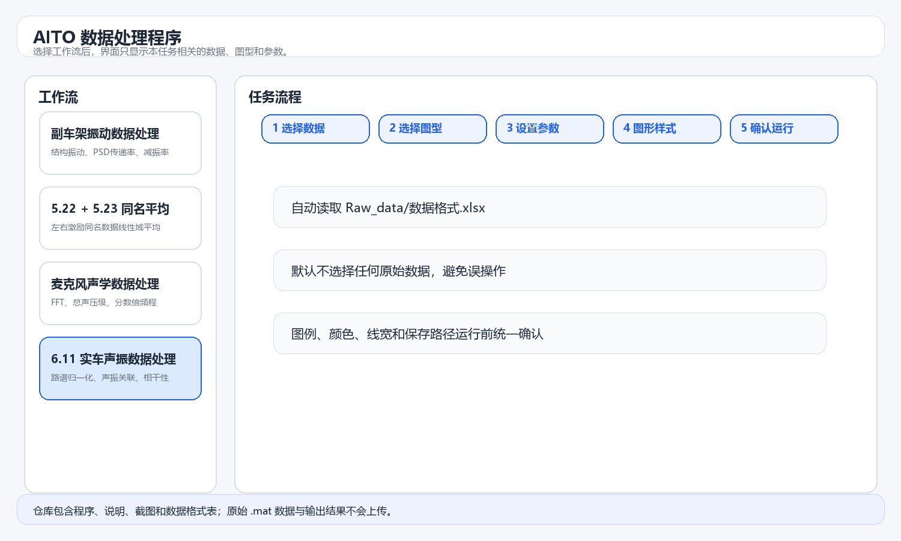
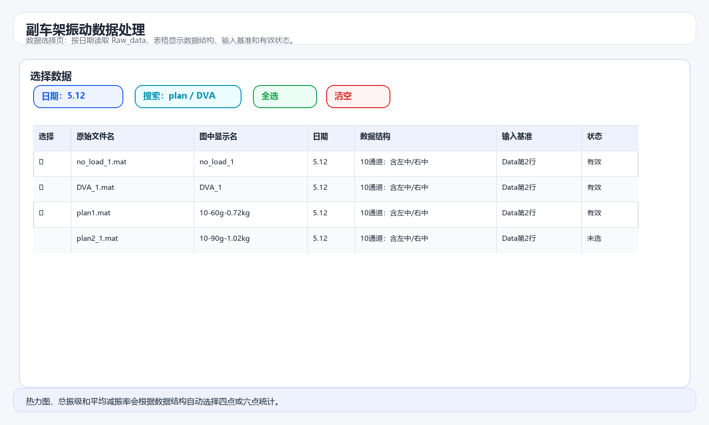
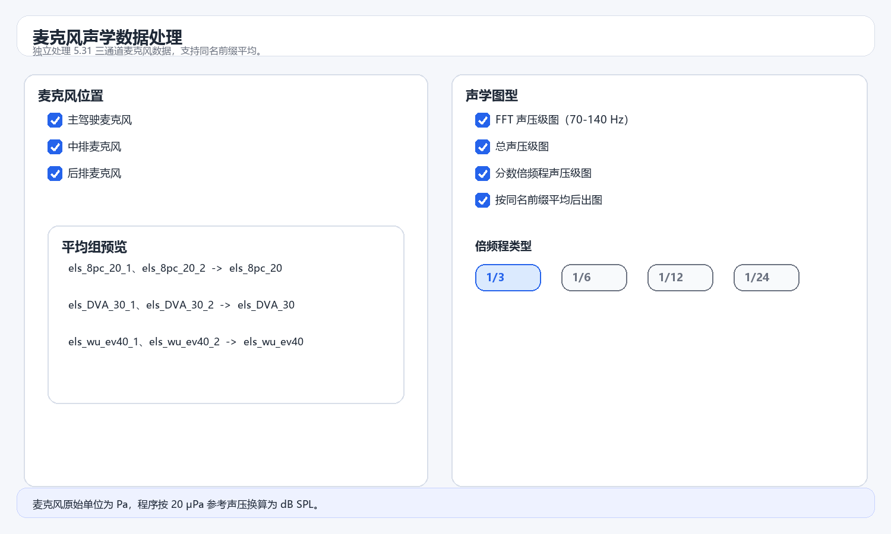
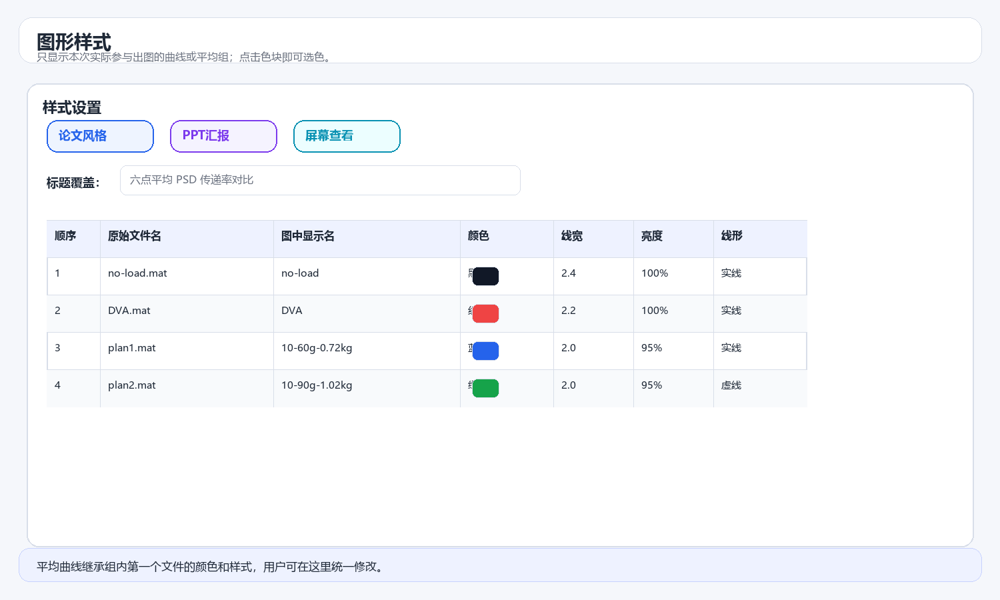
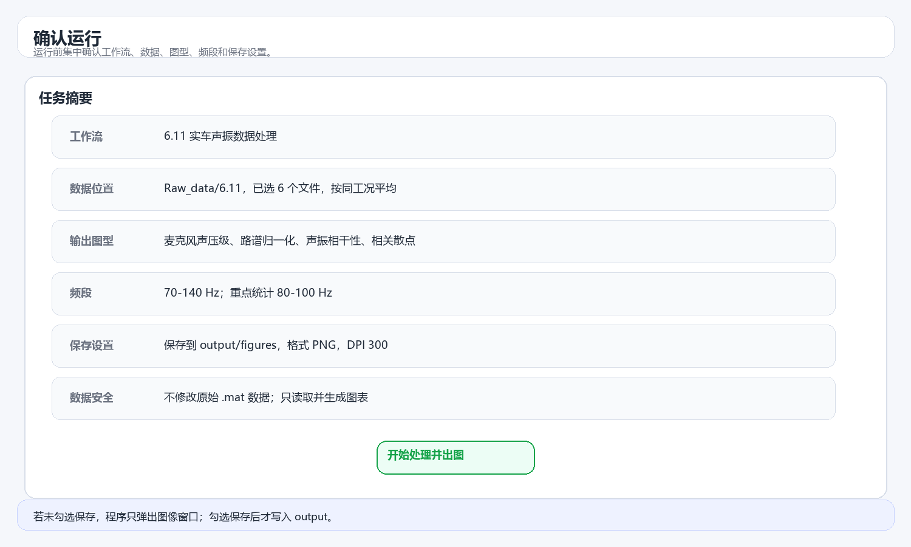

# AITO 数据处理程序

面向副车架声子晶体减振试验、麦克风声学试验和实车声振关联试验的数据处理工具。程序提供图形界面，可选择数据、图型、参数、样式和保存方式，并自动按不同日期的数据结构完成输入基准和测点映射。

## 快速启动

```bash
pip install -r requirements.txt
python main.py
```

也可以双击桌面快捷方式 `AITO 数据处理程序` 启动。

## 文件夹结构

```text
AITO_Data_processing_program/
├─ main.py
├─ chengxu/                 # 数据读取、计算、绘图、GUI
├─ themes/                  # 界面主题
├─ assets/                  # 程序图标
├─ docs/                    # 使用说明和界面截图
├─ Raw_data/                # 原始数据目录，不上传 GitHub
└─ output/                  # 默认输出目录，不上传 GitHub
```

原始数据按日期放入 `Raw_data`：

```text
Raw_data/
├─ 数据格式.xlsx            # 数据结构配置表，随仓库保留
├─ 5.8/
├─ 5.11/
├─ 5.12/
├─ 5.22/
├─ 5.23/
├─ 5.31/
└─ 6.11/
```

`数据格式.xlsx` 用于记录不同日期的数据结构、激振器位置和传感器数量。程序优先读取该表，缺失时使用内置规则兜底。

## 工作流



### 副车架振动数据处理

用于处理结构振动 `.mat` 数据，支持单输出、四点平均、六点平均、输入 PSD、输入力 PSD、FRF、归一化热力图、总振级和平均减振率。



### 5.22 + 5.23 同名平均

用于将 5.22 和 5.23 中同名工况先按线性域平均，再统一出图。该工作流只允许选择两侧同名文件，避免混入其他日期。

### 麦克风声学数据处理

用于处理 `Raw_data/5.31` 下三通道麦克风数据：

- Data 第 1 行：主驾驶麦克风；
- Data 第 2 行：中排麦克风；
- Data 第 3 行：后排麦克风。

支持 FFT 声压级、总声压级和分数倍频程声压级。FFT 声压级采用 1 Hz 频带积分；倍频程类型支持 `1/3`、`1/6`、`1/12`、`1/24`。



### 6.11 实车声振数据处理

用于处理 `Raw_data/6.11` 下的实车道路试验数据。该流程按数据格式表识别 3 个麦克风、2 个三向加速度传感器和 8 个副车架单向加速度传感器，并支持同工况重复数据平均。

可输出：

- 车内麦克风 FFT 声压级、总声压级和分数倍频程声压级；
- 副车架测点 PSD 传递率和输入归一化评价；
- 路谱归一化声压级，用于削弱不同试次路面激励差异；
- 副车架振动与车内噪声的相干性、相关散点和联合趋势图。

## 图形样式与输出

图形样式页只显示本次实际参与出图的曲线或平均组，可设置图中显示名、颜色、线宽、线形、亮度和图例顺序。若填写“完整标题覆盖”，程序会直接使用该标题；若留空，则保留默认标题，并可继续使用标题前缀、后缀。



运行前确认页会列出工作流、已选文件、图型、输入基准、统计测点规则、频段、保存路径、格式和 DPI。



未勾选“保存本次生成图像”时，程序只弹出图像窗口。勾选后，默认保存到：

```text
output/figures/
```

Excel 默认保存到：

```text
output/xlsx/
```

## 数据处理口径

结构振动主要评价输入归一化 PSD 传递率：

```text
R_i(f) = S_yy,i(f) / S_xx(f)
TL_i(f) = 10 lg[R_i(f)]
```

多测点平均先在线性域进行：

```text
R_avg(f) = Σ w_i R_i(f) / Σ w_i
```

平均减振率以 no-load 为基准：

```text
L_band = 10 lg[mean(R_avg(f))]
ΔTL = L_scheme - L_no-load
DR = [1 - 10^(ΔTL/10)] × 100%
```

麦克风数据单位为 Pa，声压参考值为 `20 μPa`。总声压级按目标频段内声压均方能量积分后换算为 dB SPL。

更多细节见：

- [界面使用说明](docs/GUI_USER_GUIDE.md)
- [数据处理方法](docs/PROCESSING_METHODS.md)

## GitHub 发布范围

仓库只保存程序、主题、图标、说明、截图和 `Raw_data/数据格式.xlsx`。原始 `.mat` 数据、输出图片、Excel 结果和缓存文件不进入仓库。

## 从 GitHub 恢复使用

1. 克隆仓库或下载压缩包。
2. 安装依赖：`pip install -r requirements.txt`。
3. 将原始 `.mat` 数据按日期放入 `Raw_data/<日期>/`。
4. 检查或补充 `Raw_data/数据格式.xlsx` 中的数据结构信息。
5. 运行：`python main.py`。
